# Detailed System Architecture & Database Diagrams

## 1. Detailed System Architecture

This diagram illustrates the comprehensive architecture of the QQ Ecommerce backend, including middleware, specific controller groups, background workers, and external service integrations.

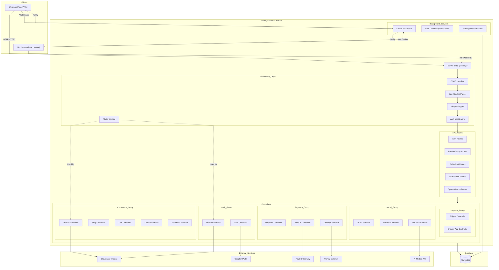
```mermaid
%%{ init: { 'flowchart': { 'curve': 'linear' } } }%%
graph TD
    subgraph Clients
        Web["Web App (React/Vite)"]
        Mobile["Mobile App (React Native)"]
    end

    subgraph Backend_Server ["Node.js Express Server"]
        entry["Server Entry (server.js)"]
        
        subgraph Middleware_Layer
            CORS[CORS Handling]
            Parser[Body/Cookie Parser]
            Logger[Morgan Logger]
            AuthMW[Auth Middleware]
            UploadMW[Multer Upload]
        end

        subgraph API_Routes
            AuthRoutes[Auth Routes]
            ProductRoutes[Product/Shop Routes]
            OrderRoutes[Order/Cart Routes]
            UserRoutes[User/Profile Routes]
            SystemRoutes[System/Admin Routes]
        end

        subgraph Controllers
            direction TB
            subgraph Auth_Group
                AC[Auth Controller]
                PC[Profile Controller]
            end
            subgraph Commerce_Group
                PrC[Product Controller]
                SC[Shop Controller]
                CC[Cart Controller]
                OC[Order Controller]
                VC[Voucher Controller]
            end
            subgraph Payment_Group
                PayC[Payment Controller]
                PayOS[PayOS Controller]
                VNP[VNPay Controller]
            end
            subgraph Social_Group
                ChatC[Chat Controller]
                RevC[Review Controller]
                AIC[AI Chat Controller]
            end
            subgraph Logistics_Group
                ShipC[Shipper Controller]
                ShipAppC[Shipper App Controller]
            end
        end

        subgraph Background_Services
            Socket["Socket.IO Service"]
            Worker1["Auto Cancel Expired Orders"]
            Worker2["Auto Approve Products"]
        end
    end

    subgraph Database
        MongoDB[("MongoDB")]
    end

    subgraph External_Services
        Cloudinary["Cloudinary (Media)"]
        GoogleAuth["Google OAuth"]
        PayOS_Service["PayOS Gateway"]
        VNPay_Service["VNPay Gateway"]
        AI_Service["AI Models API"]
    end

    %% Connections
    Web -->|HTTP/HTTPS| entry
    Mobile -->|HTTP/HTTPS| entry
    Web -->|WebSocket| Socket
    Mobile -->|WebSocket| Socket

    entry --> CORS
    CORS --> Parser
    Parser --> Logger
    Logger --> AuthMW
    AuthMW --> API_Routes
    
    API_Routes --> Controllers
    UploadMW -.->|Used by| PrC
    UploadMW -.->|Used by| PC

    Controllers --> MongoDB
    Background_Services --> MongoDB
    
    %% External Integrations
    AC --> GoogleAuth
    PrC --> Cloudinary
    PC --> Cloudinary
    PayOS --> PayOS_Service
    VNP --> VNPay_Service
    AIC --> AI_Service

    %% Socket Events
    Socket -.->|Notify| Web
    Socket -.->|Notify| Mobile
```

## 2. Detailed Entity Relationship Diagram (ERD)

This diagram represents the comprehensive data model, grouped by domain, with detailed attributes and types.

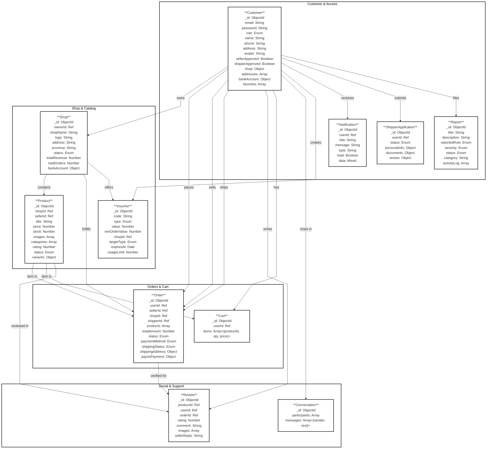
```mermaid
%%{ init: { 'flowchart': { 'curve': 'linear' } } }%%
graph TD
    classDef userFill fill:#ffffff,stroke:#000000,stroke-width:2px;
    classDef shopFill fill:#ffffff,stroke:#000000,stroke-width:2px;
    classDef orderFill fill:#ffffff,stroke:#000000,stroke-width:2px;
    classDef socialFill fill:#ffffff,stroke:#000000,stroke-width:2px;

    %% Force black and white for subgraphs
    style Customer_Management fill:#ffffff,stroke:#000000,stroke-width:2px,color:#000000
    style Shop_Product fill:#ffffff,stroke:#000000,stroke-width:2px,color:#000000
    style Order_System fill:#ffffff,stroke:#000000,stroke-width:2px,color:#000000
    style Social_Interactions fill:#ffffff,stroke:#000000,stroke-width:2px,color:#000000

    subgraph Customer_Management [Customer & Access]
        Customer["**Customer**<br>_id: ObjectId<br>email: String<br>password: String<br>role: Enum<br>name: String<br>phone: String<br>address: String<br>avatar: String<br>sellerApproved: Boolean<br>shipperApproved: Boolean<br>shop: Object<br>addresses: Array<br>bankAccount: Object<br>favorites: Array<Ref>"]:::userFill
        ShipperApp["**ShipperApplication**<br>_id: ObjectId<br>userId: Ref<Customer><br>status: Enum<br>personalInfo: Object<br>documents: Object<br>review: Object"]:::userFill
        Notification["**Notification**<br>_id: ObjectId<br>userId: Ref<Customer><br>title: String<br>message: String<br>type: String<br>read: Boolean<br>data: Mixed"]:::userFill
        Report["**Report**<br>_id: ObjectId<br>title: String<br>description: String<br>reportedRole: Enum<br>severity: Enum<br>status: Enum<br>category: String<br>activityLog: Array"]:::userFill
    end

    subgraph Shop_Product [Shop & Catalog]
        Shop["**Shop**<br>_id: ObjectId<br>ownerId: Ref<Customer><br>shopName: String<br>logo: String<br>address: String<br>province: String<br>status: Enum<br>totalRevenue: Number<br>totalOrders: Number<br>bankAccount: Object"]:::shopFill
        Product["**Product**<br>_id: ObjectId<br>shopId: Ref<Shop><br>sellerId: Ref<Customer><br>title: String<br>price: Number<br>stock: Number<br>images: Array<String><br>categories: Array<String><br>rating: Number<br>status: Enum<br>variants: Object"]:::shopFill
        Voucher["**Voucher**<br>_id: ObjectId<br>code: String<br>type: Enum<br>value: Number<br>minOrderValue: Number<br>shopId: Ref<Shop><br>targetType: Enum<br>expiresAt: Date<br>usageLimit: Number"]:::shopFill
    end

    subgraph Order_System [Orders & Cart]
        Order["**Order**<br>_id: ObjectId<br>userId: Ref<Customer><br>sellerId: Ref<Customer><br>shopId: Ref<Shop><br>shipperId: Ref<Customer><br>products: Array<Object><br>totalAmount: Number<br>status: Enum<br>paymentMethod: Enum<br>shippingStatus: Enum<br>shippingAddress: Object<br>payosPayment: Object"]:::orderFill
        Cart["**Cart**<br>_id: ObjectId<br>userId: Ref<Customer><br>items: Array<{productId, qty, price}>"]:::orderFill
    end

    subgraph Social_Interactions [Social & Support]
        Review["**Review**<br>_id: ObjectId<br>productId: Ref<Product><br>userId: Ref<Customer><br>orderId: Ref<Order><br>rating: Number<br>comment: String<br>images: Array<String><br>sellerReply: String"]:::socialFill
        Conversation["**Conversation**<br>_id: ObjectId<br>participants: Array<Ref><br>messages: Array<{sender, text}>"]:::socialFill
    end

    %% Relationships
    Customer -->|owns| Shop
    Customer -->|places| Order
    Customer -->|sells| Order
    Customer -->|ships| Order
    Customer -->|writes| Review
    Customer -->|has| Cart
    Customer -->|chats in| Conversation
    Customer -->|creates| Voucher
    Customer -->|receives| Notification
    Customer -->|submits| ShipperApp
    Customer -->|files| Report

    Shop -->|contains| Product
    Shop -->|fulfills| Order
    Shop -->|offers| Voucher

    Product -->|item in| Order
    Product -->|item in| Cart
    Product -->|reviewed in| Review
    
    Order -->|verified for| Review
```

## 2.1. Sơ đồ Tuần tự Mua sắm (Shopping Sequence Diagram)

Sơ đồ này mô tả quy trình khách hàng xem sản phẩm, thêm vào giỏ hàng và quản lý giỏ hàng trước khi đặt hàng.

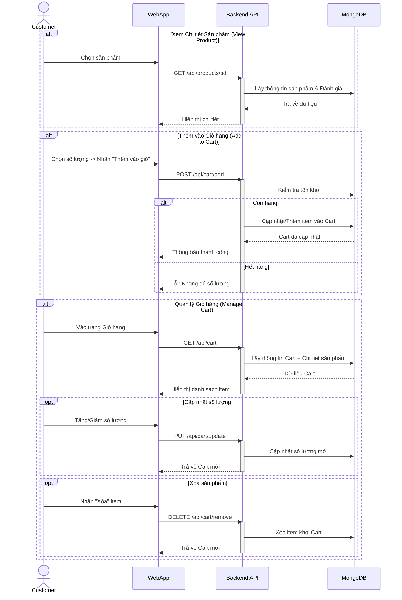
```mermaid
sequenceDiagram
    actor Customer
    participant WebApp
    participant API as Backend API
    participant DB as MongoDB

    alt Xem Chi tiết Sản phẩm (View Product)
        Customer->>WebApp: Chọn sản phẩm
        WebApp->>API: GET /api/products/:id
        activate API
        API->>DB: Lấy thông tin sản phẩm & Đánh giá
        DB-->>API: Trả về dữ liệu
        API-->>WebApp: Hiển thị chi tiết
        deactivate API
    end

    alt Thêm vào Giỏ hàng (Add to Cart)
        Customer->>WebApp: Chọn số lượng -> Nhấn "Thêm vào giỏ"
        WebApp->>API: POST /api/cart/add
        activate API
        API->>DB: Kiểm tra tồn kho
        alt Còn hàng
            API->>DB: Cập nhật/Thêm item vào Cart
            DB-->>API: Cart đã cập nhật
            API-->>WebApp: Thông báo thành công
        else Hết hàng
            API-->>WebApp: Lỗi: Không đủ số lượng
        end
        deactivate API
    end

    alt Quản lý Giỏ hàng (Manage Cart)
        Customer->>WebApp: Vào trang Giỏ hàng
        WebApp->>API: GET /api/cart
        activate API
        API->>DB: Lấy thông tin Cart + Chi tiết sản phẩm
        DB-->>API: Dữ liệu Cart
        API-->>WebApp: Hiển thị danh sách item
        deactivate API

        opt Cập nhật số lượng
            Customer->>WebApp: Tăng/Giảm số lượng
            WebApp->>API: PUT /api/cart/update
            activate API
            API->>DB: Cập nhật số lượng mới
            API-->>WebApp: Trả về Cart mới
            deactivate API
        end

        opt Xóa sản phẩm
            Customer->>WebApp: Nhấn "Xóa" item
            WebApp->>API: DELETE /api/cart/remove
            activate API
            API->>DB: Xóa item khỏi Cart
            API-->>WebApp: Trả về Cart mới
            deactivate API
        end
    end
```

## 3. Sơ đồ Tuần tự Đặt hàng (Order Placement Sequence Diagram)

Sơ đồ này thể hiện quy trình tạo đơn hàng, xử lý thanh toán và thông báo cho các bên liên quan.

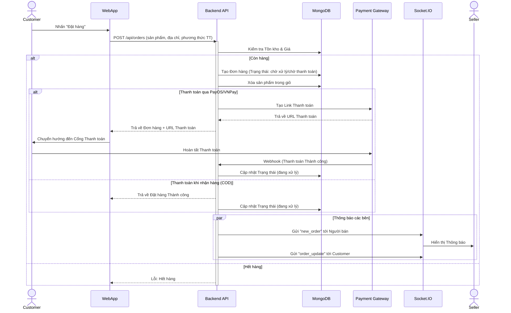
```mermaid
sequenceDiagram
    actor Customer
    participant WebApp
    participant API as Backend API
    participant DB as MongoDB
    participant PayOS as Payment Gateway
    participant Socket as Socket.IO
    actor Seller

    Customer->>WebApp: Nhấn "Đặt hàng"
    WebApp->>API: POST /api/orders (sản phẩm, địa chỉ, phương thức TT)
    activate API
    
    API->>DB: Kiểm tra Tồn kho & Giá
    alt Còn hàng
        API->>DB: Tạo Đơn hàng (Trạng thái: chờ xử lý/chờ thanh toán)
        API->>DB: Xóa sản phẩm trong giỏ
        
        alt Thanh toán qua PayOS/VNPay
            API->>PayOS: Tạo Link Thanh toán
            PayOS-->>API: Trả về URL Thanh toán
            API-->>WebApp: Trả về Đơn hàng + URL Thanh toán
            WebApp->>Customer: Chuyển hướng đến Cổng Thanh toán
            Customer->>PayOS: Hoàn tất Thanh toán
            PayOS->>API: Webhook (Thanh toán Thành công)
            API->>DB: Cập nhật Trạng thái (đang xử lý)
        else Thanh toán khi nhận hàng (COD)
            API-->>WebApp: Trả về Đặt hàng Thành công
            API->>DB: Cập nhật Trạng thái (đang xử lý)
        end

        par Thông báo các bên
            API->>Socket: Gửi "new_order" tới Người bán
            Socket->>Seller: Hiển thị Thông báo
            API->>Socket: Gửi "order_update" tới Customer
        end

    else Hết hàng
        API-->>WebApp: Lỗi: Hết hàng
    end
    deactivate API
```

## 3.1. Sơ đồ Tuần tự Thanh toán (Payment Sequence Diagram)

Sơ đồ này mô tả chi tiết quy trình xử lý thanh toán trực tuyến (ví dụ: PayOS, VNPay).

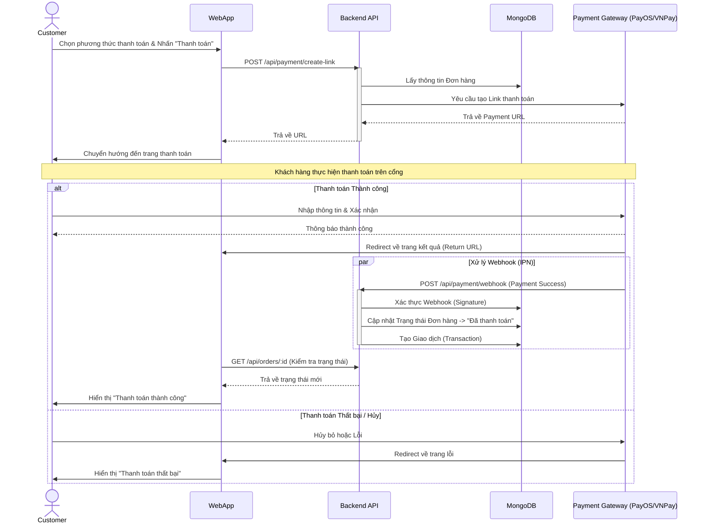
```mermaid
sequenceDiagram
    actor Customer
    participant WebApp
    participant API as Backend API
    participant DB as MongoDB
    participant Gateway as Payment Gateway (PayOS/VNPay)

    Customer->>WebApp: Chọn phương thức thanh toán & Nhấn "Thanh toán"
    WebApp->>API: POST /api/payment/create-link
    activate API
    
    API->>DB: Lấy thông tin Đơn hàng
    API->>Gateway: Yêu cầu tạo Link thanh toán
    Gateway-->>API: Trả về Payment URL
    API-->>WebApp: Trả về URL
    deactivate API

    WebApp->>Customer: Chuyển hướng đến trang thanh toán
    
    note over Customer, Gateway: Khách hàng thực hiện thanh toán trên cổng

    alt Thanh toán Thành công
        Customer->>Gateway: Nhập thông tin & Xác nhận
        Gateway-->>Customer: Thông báo thành công
        Gateway->>WebApp: Redirect về trang kết quả (Return URL)
        
        par Xử lý Webhook (IPN)
            Gateway->>API: POST /api/payment/webhook (Payment Success)
            activate API
            API->>DB: Xác thực Webhook (Signature)
            API->>DB: Cập nhật Trạng thái Đơn hàng -> "Đã thanh toán"
            API->>DB: Tạo Giao dịch (Transaction)
            deactivate API
        end
        
        WebApp->>API: GET /api/orders/:id (Kiểm tra trạng thái)
        API-->>WebApp: Trả về trạng thái mới
        WebApp->>Customer: Hiển thị "Thanh toán thành công"
        
    else Thanh toán Thất bại / Hủy
        Customer->>Gateway: Hủy bỏ hoặc Lỗi
        Gateway->>WebApp: Redirect về trang lỗi
        WebApp->>Customer: Hiển thị "Thanh toán thất bại"
    end
```

## 4. Sơ đồ Tuần tự Đăng ký (Register Sequence Diagram)

Sơ đồ này mô tả quy trình người dùng đăng ký tài khoản mới.

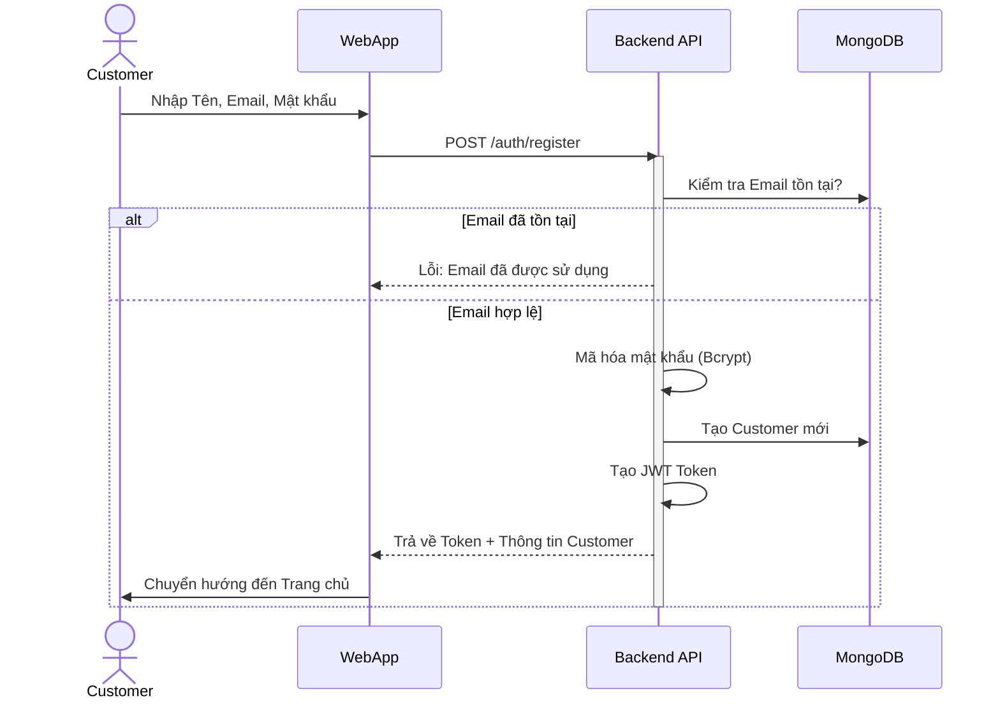
```mermaid
sequenceDiagram
    actor Customer
    participant WebApp
    participant API as Backend API
    participant DB as MongoDB

    Customer->>WebApp: Nhập Tên, Email, Mật khẩu
    WebApp->>API: POST /auth/register
    activate API
    API->>DB: Kiểm tra Email tồn tại?
    alt Email đã tồn tại
        API-->>WebApp: Lỗi: Email đã được sử dụng
    else Email hợp lệ
        API->>API: Mã hóa mật khẩu (Bcrypt)
        API->>DB: Tạo Customer mới
        API->>API: Tạo JWT Token
        API-->>WebApp: Trả về Token + Thông tin Customer
        WebApp->>Customer: Chuyển hướng đến Trang chủ
    end
    deactivate API
```

## 5. Sơ đồ Tuần tự Đăng nhập (Login Sequence Diagram)

Sơ đồ này mô tả quy trình đăng nhập thông thường và đăng nhập qua Google.

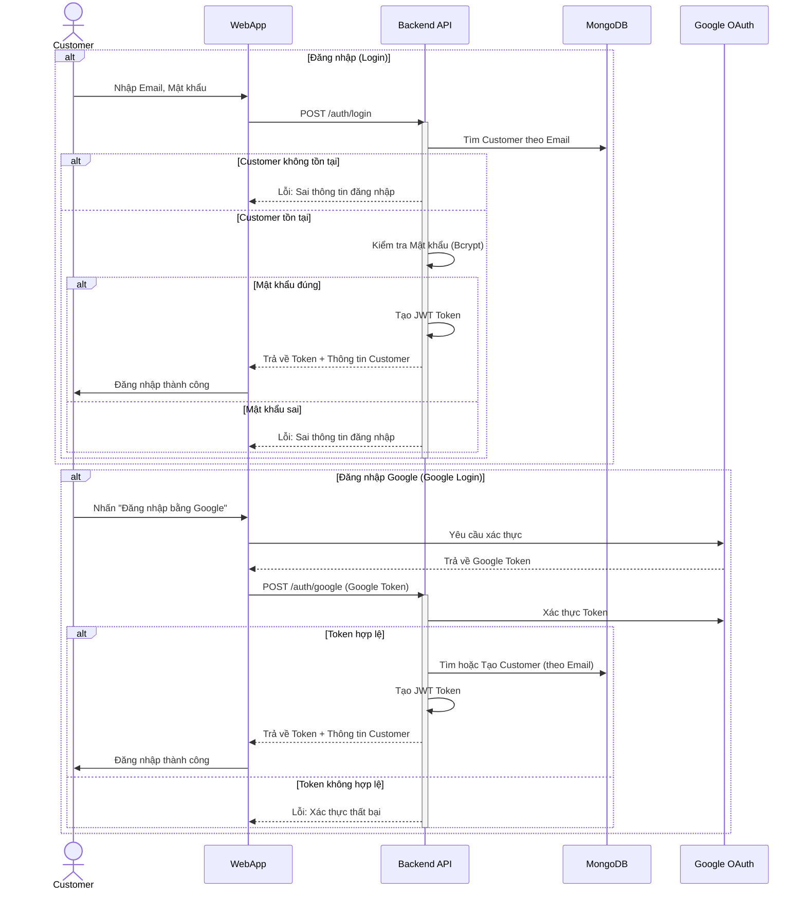
```mermaid
sequenceDiagram
    actor Customer
    participant WebApp
    participant API as Backend API
    participant DB as MongoDB
    participant Google as Google OAuth

    alt Đăng nhập (Login)
        Customer->>WebApp: Nhập Email, Mật khẩu
        WebApp->>API: POST /auth/login
        activate API
        API->>DB: Tìm Customer theo Email
        alt Customer không tồn tại
            API-->>WebApp: Lỗi: Sai thông tin đăng nhập
        else Customer tồn tại
            API->>API: Kiểm tra Mật khẩu (Bcrypt)
            alt Mật khẩu đúng
                API->>API: Tạo JWT Token
                API-->>WebApp: Trả về Token + Thông tin Customer
                WebApp->>Customer: Đăng nhập thành công
            else Mật khẩu sai
                API-->>WebApp: Lỗi: Sai thông tin đăng nhập
            end
        end
        deactivate API
    end

    alt Đăng nhập Google (Google Login)
        Customer->>WebApp: Nhấn "Đăng nhập bằng Google"
        WebApp->>Google: Yêu cầu xác thực
        Google-->>WebApp: Trả về Google Token
        WebApp->>API: POST /auth/google (Google Token)
        activate API
        API->>Google: Xác thực Token
        alt Token hợp lệ
            API->>DB: Tìm hoặc Tạo Customer (theo Email)
            API->>API: Tạo JWT Token
            API-->>WebApp: Trả về Token + Thông tin Customer
            WebApp->>Customer: Đăng nhập thành công
        else Token không hợp lệ
            API-->>WebApp: Lỗi: Xác thực thất bại
        end
        deactivate API
    end
```

## 6. Sơ đồ Tuần tự Tìm kiếm Sản phẩm (Product Search Sequence Diagram)

Sơ đồ này mô tả quy trình người dùng tìm kiếm và lọc sản phẩm.

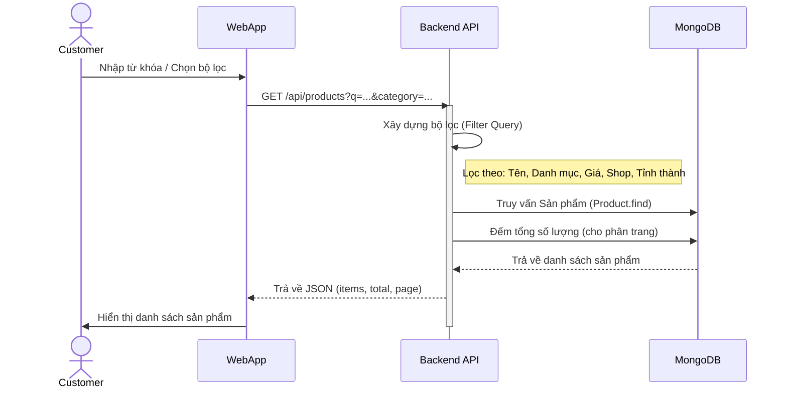
```mermaid
sequenceDiagram
    actor Customer
    participant WebApp
    participant API as Backend API
    participant DB as MongoDB

    Customer->>WebApp: Nhập từ khóa / Chọn bộ lọc
    WebApp->>API: GET /api/products?q=...&category=...
    activate API
    
    API->>API: Xây dựng bộ lọc (Filter Query)
    note right of API: Lọc theo: Tên, Danh mục, Giá, Shop, Tỉnh thành
    
    API->>DB: Truy vấn Sản phẩm (Product.find)
    API->>DB: Đếm tổng số lượng (cho phân trang)
    
    DB-->>API: Trả về danh sách sản phẩm
    API-->>WebApp: Trả về JSON (items, total, page)
    WebApp->>Customer: Hiển thị danh sách sản phẩm
    deactivate API
```

## 7. Sơ đồ Tuần tự Quản lý Tài khoản (Account Management Sequence Diagram)

Sơ đồ này mô tả quy trình người dùng xem và cập nhật thông tin cá nhân.

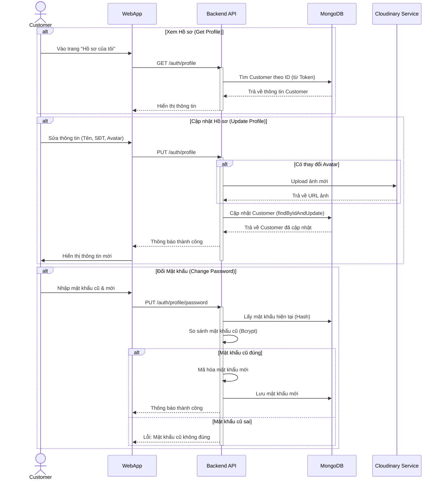
```mermaid
sequenceDiagram
    actor Customer
    participant WebApp
    participant API as Backend API
    participant DB as MongoDB
    participant Cloudinary as Cloudinary Service

    alt Xem Hồ sơ (Get Profile)
        Customer->>WebApp: Vào trang "Hồ sơ của tôi"
        WebApp->>API: GET /auth/profile
        activate API
        API->>DB: Tìm Customer theo ID (từ Token)
        DB-->>API: Trả về thông tin Customer
        API-->>WebApp: Hiển thị thông tin
        deactivate API
    end

    alt Cập nhật Hồ sơ (Update Profile)
        Customer->>WebApp: Sửa thông tin (Tên, SĐT, Avatar)
        WebApp->>API: PUT /auth/profile
        activate API
        
        alt Có thay đổi Avatar
            API->>Cloudinary: Upload ảnh mới
            Cloudinary-->>API: Trả về URL ảnh
        end

        API->>DB: Cập nhật Customer (findByIdAndUpdate)
        DB-->>API: Trả về Customer đã cập nhật
        API-->>WebApp: Thông báo thành công
        WebApp->>Customer: Hiển thị thông tin mới
        deactivate API
    end

    alt Đổi Mật khẩu (Change Password)
        Customer->>WebApp: Nhập mật khẩu cũ & mới
        WebApp->>API: PUT /auth/profile/password
        activate API
        API->>DB: Lấy mật khẩu hiện tại (Hash)
        API->>API: So sánh mật khẩu cũ (Bcrypt)
        
        alt Mật khẩu cũ đúng
            API->>API: Mã hóa mật khẩu mới
            API->>DB: Lưu mật khẩu mới
            API-->>WebApp: Thông báo thành công
        else Mật khẩu cũ sai
            API-->>WebApp: Lỗi: Mật khẩu cũ không đúng
        end
        deactivate API
    end
```

## 8. Sơ đồ Tuần tự Quản lý Sản phẩm (Product Management Sequence Diagram)

Sơ đồ này mô tả toàn bộ quy trình quản lý sản phẩm. Hệ thống được cấu hình để **tự động duyệt** sản phẩm mới đăng.

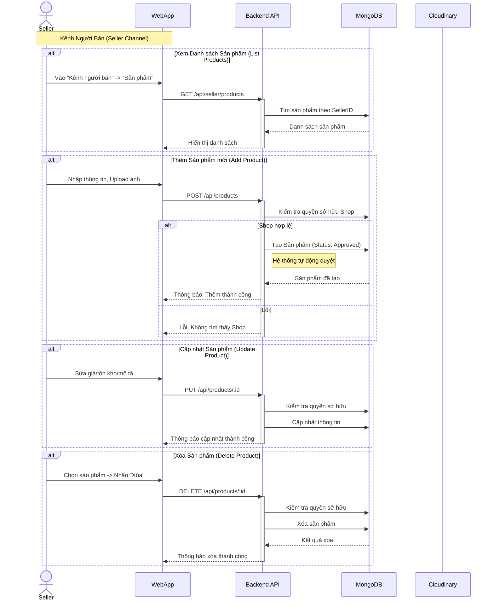
```mermaid
sequenceDiagram
    actor Seller
    participant WebApp
    participant API as Backend API
    participant DB as MongoDB
    participant Cloudinary

    %% --- SELLER ACTIONS ---
    note over Seller, WebApp: Kênh Người Bán (Seller Channel)

    alt Xem Danh sách Sản phẩm (List Products)
        Seller->>WebApp: Vào "Kênh người bán" -> "Sản phẩm"
        WebApp->>API: GET /api/seller/products
        activate API
        API->>DB: Tìm sản phẩm theo SellerID
        DB-->>API: Danh sách sản phẩm
        API-->>WebApp: Hiển thị danh sách
        deactivate API
    end

    alt Thêm Sản phẩm mới (Add Product)
        Seller->>WebApp: Nhập thông tin, Upload ảnh
        WebApp->>API: POST /api/products
        activate API
        
        API->>DB: Kiểm tra quyền sở hữu Shop
        
        alt Shop hợp lệ
            API->>DB: Tạo Sản phẩm (Status: Approved)
            note right of API: Hệ thống tự động duyệt
            DB-->>API: Sản phẩm đã tạo
            API-->>WebApp: Thông báo: Thêm thành công
        else Lỗi
            API-->>WebApp: Lỗi: Không tìm thấy Shop
        end
        deactivate API
    end

    alt Cập nhật Sản phẩm (Update Product)
        Seller->>WebApp: Sửa giá/tồn kho/mô tả
        WebApp->>API: PUT /api/products/:id
        activate API
        API->>DB: Kiểm tra quyền sở hữu
        API->>DB: Cập nhật thông tin
        API-->>WebApp: Thông báo cập nhật thành công
        deactivate API
    end

    alt Xóa Sản phẩm (Delete Product)
        Seller->>WebApp: Chọn sản phẩm -> Nhấn "Xóa"
        WebApp->>API: DELETE /api/products/:id
        activate API
        API->>DB: Kiểm tra quyền sở hữu
        API->>DB: Xóa sản phẩm
        DB-->>API: Kết quả xóa
        API-->>WebApp: Thông báo xóa thành công
        deactivate API
    end
```

## 9. Sơ đồ Tuần tự Giao nhận hàng (Delivery Sequence Diagram)

Sơ đồ này mô tả quy trình shipper nhận và giao đơn hàng.

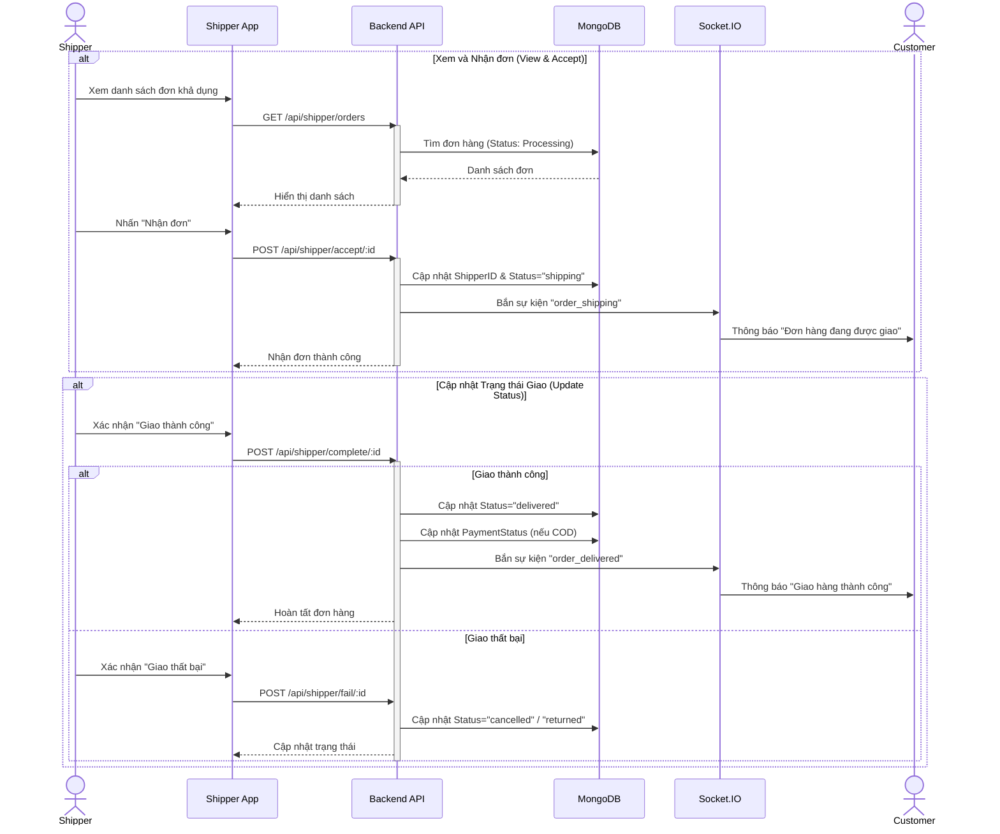
```mermaid
sequenceDiagram
    actor Shipper
    participant App as Shipper App
    participant API as Backend API
    participant DB as MongoDB
    participant Socket as Socket.IO
    actor Customer

    alt Xem và Nhận đơn (View & Accept)
        Shipper->>App: Xem danh sách đơn khả dụng
        App->>API: GET /api/shipper/orders
        activate API
        API->>DB: Tìm đơn hàng (Status: Processing)
        DB-->>API: Danh sách đơn
        API-->>App: Hiển thị danh sách
        deactivate API

        Shipper->>App: Nhấn "Nhận đơn"
        App->>API: POST /api/shipper/accept/:id
        activate API
        API->>DB: Cập nhật ShipperID & Status="shipping"
        API->>Socket: Bắn sự kiện "order_shipping"
        Socket->>Customer: Thông báo "Đơn hàng đang được giao"
        API-->>App: Nhận đơn thành công
        deactivate API
    end

    alt Cập nhật Trạng thái Giao (Update Status)
        Shipper->>App: Xác nhận "Giao thành công"
        App->>API: POST /api/shipper/complete/:id
        activate API
        
        alt Giao thành công
            API->>DB: Cập nhật Status="delivered"
            API->>DB: Cập nhật PaymentStatus (nếu COD)
            API->>Socket: Bắn sự kiện "order_delivered"
            Socket->>Customer: Thông báo "Giao hàng thành công"
            API-->>App: Hoàn tất đơn hàng
        else Giao thất bại
            Shipper->>App: Xác nhận "Giao thất bại"
            App->>API: POST /api/shipper/fail/:id
            API->>DB: Cập nhật Status="cancelled" / "returned"
            API-->>App: Cập nhật trạng thái
        end
        deactivate API
    end
```

## 10. Sơ đồ Lớp (Class Diagram)

Sơ đồ này mô tả cấu trúc các lớp (Models) trong hệ thống và mối quan hệ giữa chúng.

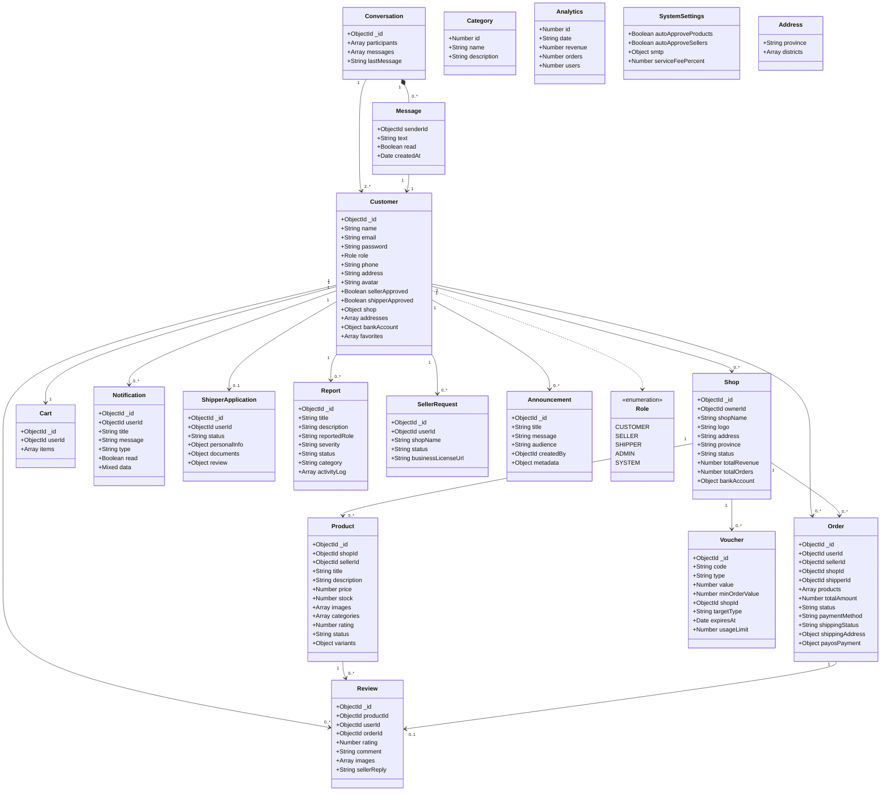
```mermaid
classDiagram
    %% User Relationships
    Customer "1" --> "0..*" Shop
    Customer "1" --> "0..*" Order
    Customer "1" --> "0..*" Review
    Customer "1" --> "1" Cart
    Customer "1" --> "0..*" Notification
    Customer "1" --> "0..1" ShipperApplication
    Customer "1" --> "0..*" Report
    Customer "1" --> "0..*" SellerRequest
    Customer "1" --> "0..*" Announcement
    
    %% Shop Relationships
    Shop "1" --> "0..*" Product
    Shop "1" --> "0..*" Order
    Shop "1" --> "0..*" Voucher

    %% Product Relationships
    Product "1" --> "0..*" Review
    
    %% Order Relationships
    Order "1" --> "0..1" Review

    %% Conversation Relationships
    Conversation "1" --> "2..*" Customer
    Conversation "1" *-- "0..*" Message

    %% Message Relationships
    Message "1" --> "1" Customer

    %% Enums
    Customer ..> Role

    class Role {
        <<enumeration>>
        CUSTOMER
        SELLER
        SHIPPER
        ADMIN
        SYSTEM
    }

    class Customer {
        +ObjectId _id
        +String name
        +String email
        +String password
        +Role role
        +String phone
        +String address
        +String avatar
        +Boolean sellerApproved
        +Boolean shipperApproved
        +Object shop
        +Array addresses
        +Object bankAccount
        +Array favorites
    }

    class Shop {
        +ObjectId _id
        +ObjectId ownerId
        +String shopName
        +String logo
        +String address
        +String province
        +String status
        +Number totalRevenue
        +Number totalOrders
        +Object bankAccount
    }

    class Product {
        +ObjectId _id
        +ObjectId shopId
        +ObjectId sellerId
        +String title
        +String description
        +Number price
        +Number stock
        +Array images
        +Array categories
        +Number rating
        +String status
        +Object variants
    }

    class Order {
        +ObjectId _id
        +ObjectId userId
        +ObjectId sellerId
        +ObjectId shopId
        +ObjectId shipperId
        +Array products
        +Number totalAmount
        +String status
        +String paymentMethod
        +String shippingStatus
        +Object shippingAddress
        +Object payosPayment
    }

    class Cart {
        +ObjectId _id
        +ObjectId userId
        +Array items
    }

    class Review {
        +ObjectId _id
        +ObjectId productId
        +ObjectId userId
        +ObjectId orderId
        +Number rating
        +String comment
        +Array images
        +String sellerReply
    }

    class Voucher {
        +ObjectId _id
        +String code
        +String type
        +Number value
        +Number minOrderValue
        +ObjectId shopId
        +String targetType
        +Date expiresAt
        +Number usageLimit
    }

    class Notification {
        +ObjectId _id
        +ObjectId userId
        +String title
        +String message
        +String type
        +Boolean read
        +Mixed data
    }

    class ShipperApplication {
        +ObjectId _id
        +ObjectId userId
        +String status
        +Object personalInfo
        +Object documents
        +Object review
    }

    class Report {
        +ObjectId _id
        +String title
        +String description
        +String reportedRole
        +String severity
        +String status
        +String category
        +Array activityLog
    }
    
    class SellerRequest {
        +ObjectId _id
        +ObjectId userId
        +String shopName
        +String status
        +String businessLicenseUrl
    }

    class Announcement {
        +ObjectId _id
        +String title
        +String message
        +String audience
        +ObjectId createdBy
        +Object metadata
    }

    class Conversation {
        +ObjectId _id
        +Array participants
        +Array messages
        +String lastMessage
    }

    class Message {
        +ObjectId senderId
        +String text
        +Boolean read
        +Date createdAt
    }

    class Category {
        +Number id
        +String name
        +String description
    }

    class Analytics {
        +Number id
        +String date
        +Number revenue
        +Number orders
        +Number users
    }

    class SystemSettings {
        +Boolean autoApproveProducts
        +Boolean autoApproveSellers
        +Object smtp
        +Number serviceFeePercent
    }

    class Address {
        +String province
        +Array districts
    }
```

## 11. Sơ đồ Hoạt động (Activity Diagrams)

### 10.1. Hoạt động Đăng Nhập (Login Activity)

```mermaid
%%{ init: { 'flowchart': { 'curve': 'linear' } } }%%
graph TD
    %% Define styles for Activity Diagram elements
    classDef action fill:#fff,stroke:#000,stroke-width:1px,rx:10,ry:10;
    classDef decision fill:#fff,stroke:#000,stroke-width:1px,rx:0,ry:0;
    classDef startNode fill:#000,stroke:#000,stroke-width:1px;
    classDef endNode fill:#000,stroke:#fff,stroke-width:4px;

    subgraph Customer_Lane [Customer]
        direction TB
        Start(( )):::startNode
        Login(Đăng nhập):::action
        Input(Nhập tài khoản, mật khẩu):::action
    end

    subgraph System_Lane [Hệ thống]
        direction TB
        Check(Kiểm tra thông tin):::action
        Decision{Hợp lệ?}:::decision
        Error(Báo lỗi):::action
        Save(Lưu thông tin tài khoản):::action
        End(( )):::endNode
    end

    Start --> Login
    Login --> Input
    Input --> Check
    Check --> Decision
    Decision -- Sai --> Error
    Error --> Input
    Decision -- Đúng --> Save
    Save --> End
```

### 10.2. Hoạt động Mua sắm & Thanh toán (Shopping & Checkout Activity)

Sơ đồ này mô tả chi tiết quy trình mua sắm, từ lúc chọn sản phẩm, kiểm tra tồn kho, đến các trường hợp xử lý thanh toán (thành công, thất bại, thử lại).

```mermaid
graph TD
    %% Define styles for Activity Diagram elements
    classDef action fill:#fff,stroke:#000,stroke-width:1px,rx:5,ry:5;
    classDef decision fill:#fff,stroke:#000,stroke-width:1px,rx:5,ry:5;
    classDef startNode fill:#000,stroke:#000,stroke-width:1px;
    classDef endNode fill:#000,stroke:#fff,stroke-width:4px;

    subgraph Customer_Lane [Customer]
        direction TB
        Start(( )):::startNode
        ViewDetails(Xem chi tiết sản phẩm):::action
        SelectProduct(Chọn sản phẩm):::action
        ActionDecision{Hành động?}:::decision
        
        ClickAddToCart(Nhấn 'Thêm vào giỏ'):::action
        ClickBuyNow(Nhấn 'Mua ngay'):::action
        
        AddedDecision{Đã thêm giỏ?}:::decision
        ViewCart(Xem giỏ hàng):::action
        ClickCheckout(Nhấn 'Thanh toán'):::action
        
        InputInfo(Nhập địa chỉ giao hàng):::action
        SelectVoucher(Chọn Voucher - nếu có):::action
        SelectPayment(Chọn phương thức thanh toán):::action
        ConfirmOrder(Xác nhận đơn hàng):::action
        
        PayOS_Payment(Thanh toán trên PayOS):::action
        
        HandleFail(Chọn cách xử lý):::action
        RetryDecision{Lựa chọn trong 12h?}:::decision
        RetryPayOS_Action(Thanh toán lại):::action
        SwitchCOD(Chọn COD):::action
        
        ShowSuccess(Hiển thị đặt hàng thành công):::action
        ViewInvoice(Xem hóa đơn):::action
        End(( )):::endNode
    end

    subgraph System_Lane [System]
        direction TB
        CheckStock{Còn tồn kho?}:::decision
        StockError(Báo lỗi hết hàng):::action
        
        CreateOrder(Tạo đơn hàng):::action
        MethodDecision{Phương thức?}:::decision
        
        UpdateCOD(Cập nhật đơn hàng COD):::action
        
        CreateLink(Tạo Link PayOS):::action
        PayStatus{Thanh toán thành công?}:::decision
        
        UpdatePaid(Cập nhật đơn đã thanh toán):::action
        UpdatePending(Cập nhật đơn CHỜ THANH TOÁN):::action
        
        AutoCancel(Tự động HỦY ĐƠN):::action
        ReCreateLink(Tạo lại Link PayOS):::action
        UpdateToCOD(Cập nhật đơn sang COD):::action
        
        ClearCart(Xóa giỏ hàng):::action
    end

    %% Flow
    Start --> ViewDetails
    ViewDetails --> SelectProduct
    SelectProduct --> ActionDecision
    
    ActionDecision -- Thêm giỏ --> ClickAddToCart
    ActionDecision -- Mua ngay --> ClickBuyNow
    
    %% Stock Check
    ClickAddToCart --> CheckStock
    ClickBuyNow --> CheckStock
    
    CheckStock -- Không --> StockError
    StockError --> ViewDetails
    
    %% Logic to return to correct path
    CheckStock -- Có (Thêm giỏ) --> AddedDecision
    CheckStock -- Có (Mua ngay) --> ClickCheckout
    
    AddedDecision -- Xem giỏ --> ViewCart
    AddedDecision -- Tiếp tục mua --> ViewDetails
    
    ViewCart --> ClickCheckout
    
    %% Checkout Process
    ClickCheckout --> InputInfo
    InputInfo --> SelectVoucher
    SelectVoucher --> SelectPayment
    SelectPayment --> ConfirmOrder
    ConfirmOrder --> CreateOrder
    
    CreateOrder --> MethodDecision
    
    %% COD Path
    MethodDecision -- COD --> UpdateCOD
    UpdateCOD --> ClearCart
    
    %% PayOS Path
    MethodDecision -- PayOS --> CreateLink
    CreateLink --> PayOS_Payment
    PayOS_Payment --> PayStatus
    
    PayStatus -- Thành công --> UpdatePaid
    UpdatePaid --> ClearCart
    
    PayStatus -- Thất bại --> UpdatePending
    UpdatePending --> HandleFail
    
    HandleFail --> RetryDecision
    
    %% Retry Logic
    RetryDecision -- Hết 12h --> AutoCancel
    AutoCancel --> End
    
    RetryDecision -- Thử lại PayOS --> ReCreateLink
    ReCreateLink --> RetryPayOS_Action
    RetryPayOS_Action --> PayStatus
    
    RetryDecision -- Đổi sang COD --> SwitchCOD
    SwitchCOD --> UpdateToCOD
    UpdateToCOD --> ClearCart
    
    %% Final
    ClearCart --> ShowSuccess
    ShowSuccess --> ViewInvoice
    ViewInvoice --> End
```

### 10.4. Hoạt động Thêm Sản phẩm (Add Product Activity - Seller)

```mermaid
%%{ init: { 'flowchart': { 'curve': 'linear' } } }%%
graph TD
    classDef default fill:#fff,stroke:#000,stroke-width:1px,rx:5,ry:5;
    classDef black fill:#000,stroke:#000,stroke-width:1px;
    classDef endnode fill:#000,stroke:#fff,stroke-width:4px;

    subgraph Seller_Lane [Người bán]
        direction TB
        Start(( )):::black
        Dashboard[Vào trang Quản lý]
        New[Nhấn 'Thêm sản phẩm']
        Form[Nhập thông tin & Ảnh]
        Submit[Gửi yêu cầu]
    end

    subgraph System_Lane [Hệ thống]
        direction TB
        Validate{Kiểm tra dữ liệu}
        Error[Hiển thị lỗi]
        Save[Lưu vào Database]
        Notify[Thông báo thành công]
        End(( )):::endnode
    end

    Start --> Dashboard
    Dashboard --> New
    New --> Form
    Form --> Submit
    Submit --> Validate
    
    Validate -- Thiếu/Sai --> Error
    Error --> Form
    
    Validate -- Hợp lệ --> Save
    Save --> Notify
    Notify --> End
```

### 10.5. Hoạt động Tìm kiếm (Search Activity)

```mermaid
%%{ init: { 'flowchart': { 'curve': 'linear' } } }%%
graph TD
    classDef default fill:#fff,stroke:#000,stroke-width:1px,rx:5,ry:5;
    classDef black fill:#000,stroke:#000,stroke-width:1px;
    classDef endnode fill:#000,stroke:#fff,stroke-width:4px;

    subgraph Customer_Lane [Customer]
        direction TB
        Start(( )):::black
        Input[Nhập từ khóa]
        Request[Gửi tìm kiếm]
    end

    subgraph System_Lane [Hệ thống]
        direction TB
        Query{Tìm trong DB}
        Empty[Hiển thị 'Không tìm thấy']
        Display[Hiển thị kết quả]
        End(( )):::endnode
    end

    Start --> Input
    Input --> Request
    Request --> Query
    
    Query -- Không có --> Empty
    Empty --> End
    
    Query -- Có kết quả --> Display
    Display --> End
```

### 10.6. Hoạt động Quản lý Doanh Thu (Revenue Management Activity)

```mermaid
%%{ init: { 'flowchart': { 'curve': 'linear' } } }%%
graph TD
    %% Define styles for Activity Diagram elements
    classDef action fill:#fff,stroke:#000,stroke-width:1px,rx:10,ry:10;
    classDef decision fill:#fff,stroke:#000,stroke-width:1px,rx:0,ry:0;
    classDef startNode fill:#000,stroke:#000,stroke-width:1px;
    classDef endNode fill:#000,stroke:#fff,stroke-width:4px;

    subgraph Seller_Lane [Người bán]
        direction TB
        Start(( )):::startNode
        Dashboard(Vào trang Thống kê):::action
        Select(Chọn khoảng thời gian):::action
        View(Xem báo cáo chi tiết):::action
    end

    subgraph System_Lane [Hệ thống]
        direction TB
        Query(Truy vấn & Tính toán):::action
        Decision{Có dữ liệu?}:::decision
        Empty(Hiển thị 'Chưa có số liệu'):::action
        Display(Hiển thị Biểu đồ & Doanh thu):::action
        End(( )):::endNode
    end

    Start --> Dashboard
    Dashboard --> Select
    Select --> Query
    Query --> Decision
    
    Decision -- Không --> Empty
    Empty --> End
    
    Decision -- Có --> Display
    Display --> View
    View --> End
```

### 10.7. Hoạt động Giao nhận hàng (Delivery Activity)

```mermaid
%%{ init: { 'flowchart': { 'curve': 'linear' } } }%%
graph TD
    %% Define styles for Activity Diagram elements
    classDef action fill:#fff,stroke:#000,stroke-width:1px,rx:10,ry:10;
    classDef decision fill:#fff,stroke:#000,stroke-width:1px,rx:0,ry:0;
    classDef startNode fill:#000,stroke:#000,stroke-width:1px;
    classDef endNode fill:#000,stroke:#fff,stroke-width:4px;

    subgraph Shipper_Lane [Shipper]
        direction TB
        Start(( )):::startNode
        View(Xem danh sách đơn):::action
        Accept(Nhận đơn hàng):::action
        Pickup(Lấy hàng & Giao):::action
        Confirm(Xác nhận kết quả):::action
    end

    subgraph System_Lane [Hệ thống]
        direction TB
        UpdateShip(Cập nhật 'Đang giao'):::action
        Decision{Giao thành công?}:::decision
        UpdateFail(Cập nhật 'Giao thất bại'):::action
        UpdateSuccess(Cập nhật 'Đã giao'):::action
        COD(Xử lý COD & Ví):::action
        End(( )):::endNode
    end

    Start --> View
    View --> Accept
    Accept --> UpdateShip
    UpdateShip --> Pickup
    Pickup --> Confirm
    Confirm --> Decision
    
    Decision -- Thất bại --> UpdateFail
    UpdateFail --> End
    
    Decision -- Thành công --> UpdateSuccess
    UpdateSuccess --> COD
    COD --> End
```

### 10.8. Hoạt động Duyệt Tài khoản (Account Approval Activity)

Sơ đồ này mô tả quy trình Admin duyệt yêu cầu đăng ký trở thành Người bán (Seller) hoặc Shipper.

```mermaid
graph TD
    %% Define styles
    classDef action fill:#fff,stroke:#000,stroke-width:1px,rx:10,ry:10;
    classDef decision fill:#fff,stroke:#000,stroke-width:1px,rx:0,ry:0;
    classDef startNode fill:#000,stroke:#000,stroke-width:1px;
    classDef endNode fill:#000,stroke:#fff,stroke-width:4px;

    subgraph User_Lane [Người dùng (Seller/Shipper)]
        direction TB
        Start(( )):::startNode
        Register(Đăng ký / Gửi yêu cầu):::action
        UploadDocs(Tải lên giấy tờ xác minh):::action
        Wait(Chờ duyệt):::action
        ReceiveNotify(Nhận thông báo):::action
        End(( )):::endNode
    end

    subgraph System_Lane [Hệ thống]
        direction TB
        Validate(Kiểm tra dữ liệu):::action
        SaveRequest(Lưu yêu cầu - Pending):::action
        UpdateStatus(Cập nhật trạng thái):::action
        SendNotify(Gửi Email/Thông báo):::action
    end

    subgraph Admin_Lane [Admin]
        direction TB
        ViewList(Xem danh sách chờ duyệt):::action
        Review(Kiểm tra thông tin & Giấy tờ):::action
        Decision{Duyệt?}:::decision
        Approve(Chấp thuận):::action
        Reject(Từ chối):::action
    end

    %% Flow
    Start --> Register
    Register --> UploadDocs
    UploadDocs --> Validate
    Validate --> SaveRequest
    SaveRequest --> Wait
    
    Wait -.-> ViewList
    ViewList --> Review
    Review --> Decision
    
    Decision -- Đồng ý --> Approve
    Decision -- Từ chối --> Reject
    
    Approve --> UpdateStatus
    Reject --> UpdateStatus
    
    UpdateStatus --> SendNotify
    SendNotify --> ReceiveNotify
    ReceiveNotify --> End
```

### 10.9. Hoạt động Áp dụng Voucher (Apply Voucher Activity)

Sơ đồ này mô tả quy trình kiểm tra và áp dụng mã giảm giá (Voucher) vào đơn hàng.

```mermaid
graph TD
    %% Define styles
    classDef action fill:#fff,stroke:#000,stroke-width:1px,rx:10,ry:10;
    classDef decision fill:#fff,stroke:#000,stroke-width:1px,rx:0,ry:0;
    classDef startNode fill:#000,stroke:#000,stroke-width:1px;
    classDef endNode fill:#000,stroke:#fff,stroke-width:4px;

    subgraph Customer_Lane [Customer]
        direction TB
        Start(( )):::startNode
        InCheckout(Tại trang Thanh toán):::action
        InputCode(Nhập mã hoặc Chọn Voucher):::action
        ViewTotal(Xem tổng tiền mới):::action
    end

    subgraph System_Lane [Hệ thống]
        direction TB
        Validate{Kiểm tra điều kiện}:::decision
        
        CheckExist{Tồn tại & Còn hạn?}:::decision
        CheckMin{Đủ giá trị đơn tối thiểu?}:::decision
        CheckLimit{Còn lượt sử dụng?}:::decision
        
        ShowError(Hiển thị lỗi):::action
        Calc(Tính số tiền giảm):::action
        Apply(Áp dụng & Cập nhật Tổng):::action
        End(( )):::endNode
    end

    Start --> InCheckout
    InCheckout --> InputCode
    InputCode --> Validate
    
    Validate --> CheckExist
    CheckExist -- Không --> ShowError
    CheckExist -- Có --> CheckMin
    
    CheckMin -- Không --> ShowError
    CheckMin -- Có --> CheckLimit
    
    CheckLimit -- Không --> ShowError
    CheckLimit -- Có --> Calc
    
    Calc --> Apply
    Apply --> ViewTotal
    ShowError --> InputCode
    ViewTotal --> End
```

## 12. Sơ đồ Use Case (Use Case Diagrams)

### 11.1. Use Case Khách hàng (Customer)

```mermaid
graph LR
    %% Actor
    Customer["👤 Khách hàng (Customer)"]

    %% System Boundary
    subgraph System["Hệ thống QQ Ecommerce"]
        direction TB
        UC1(("Đăng ký / Đăng nhập"))
        UC2(("Tìm kiếm sản phẩm"))
        UC3(("Xem chi tiết sản phẩm"))
        UC4(("Quản lý giỏ hàng"))
        UC5(("Đặt hàng & Thanh toán"))
        UC6(("Xem lịch sử đơn hàng"))
        UC7(("Đánh giá sản phẩm"))
        UC8(("Quản lý hồ sơ cá nhân"))
        UC9(("Chat với người bán"))
        UC10(("Báo cáo vi phạm"))
        UC11(("Áp dụng Voucher"))
    end

    %% Relationships
    Customer --> UC1
    Customer --> UC2
    Customer --> UC3
    Customer --> UC4
    Customer --> UC5
    Customer --> UC6
    Customer --> UC7
    Customer --> UC8
    Customer --> UC9
    Customer --> UC10
    UC5 -.->|<< include >>| UC11
```

### 11.2. Use Case Người Bán (Seller)

```mermaid
graph LR
    %% Actor
    Seller["👤 Người bán (Seller)"]

    %% System Boundary
    subgraph SellerChannel["Kênh Người Bán"]
        direction TB
        UC_S1(("Đăng nhập"))
        UC_S2(("Quản lý sản phẩm"))
        UC_S3(("Quản lý đơn hàng"))
        UC_S4(("Xem thống kê doanh thu"))
        UC_S5(("Chat với khách hàng"))
        UC_S6(("Phản hồi đánh giá"))
        UC_S7(("Quản lý hồ sơ Shop"))
        UC_S8(("Quản lý Khuyến mãi"))
        UC_S9(("Quản lý ví"))
    end

    %% Relationships
    Seller --> UC_S1
    Seller --> UC_S2
    Seller --> UC_S3
    Seller --> UC_S4
    Seller --> UC_S5
    Seller --> UC_S6
    Seller --> UC_S7
    Seller --> UC_S8
    Seller --> UC_S9
```

#### Đặc tả Use Case Người Bán

| Mã UC | Tên Use Case | Mô tả | Tác nhân |
| :--- | :--- | :--- | :--- |
| **UC_S1** | **Đăng nhập** | Đăng nhập vào Kênh Người Bán để quản lý shop. | Seller |
| **UC_S2** | **Quản lý sản phẩm** | Thêm sản phẩm mới, sửa thông tin, cập nhật giá/tồn kho, xóa hoặc ẩn sản phẩm. | Seller |
| **UC_S3** | **Quản lý đơn hàng** | Xem danh sách đơn hàng, xác nhận đơn, in phiếu giao hàng, theo dõi trạng thái giao. | Seller |
| **UC_S4** | **Xem thống kê** | Xem báo cáo doanh thu, số lượng đơn hàng, sản phẩm bán chạy theo ngày/tháng. | Seller |
| **UC_S5** | **Chat với khách** | Nhận và trả lời tin nhắn từ khách hàng về sản phẩm hoặc đơn hàng. | Seller |
| **UC_S6** | **Phản hồi đánh giá** | Xem các đánh giá của khách hàng và gửi phản hồi. | Seller |
| **UC_S7** | **Quản lý hồ sơ Shop** | Cập nhật thông tin shop (tên, logo, địa chỉ lấy hàng), thiết lập vận chuyển. | Seller |
| **UC_S8** | **Quản lý Khuyến mãi** | Tạo mã giảm giá (Voucher), thiết lập điều kiện áp dụng (giá trị tối thiểu, hạn sử dụng), quản lý danh sách voucher. | Seller |
| **UC_S9** | **Quản lý ví** | Xem số dư ví người bán, lịch sử giao dịch, yêu cầu rút tiền về tài khoản ngân hàng. | Seller |

### 11.2.1. Chi tiết Use Case Quản lý Sản phẩm

Sơ đồ này mô tả chi tiết các chức năng con trong Use Case "Quản lý sản phẩm".

```mermaid
graph LR
    Seller["👤 Người bán (Seller)"]
    
    subgraph System["Hệ thống"]
        Manage(("Quản lý sản phẩm"))
        Search(("Tìm kiếm sản phẩm"))
        Delete(("Xóa sản phẩm"))
        Update(("Cập nhật sản phẩm"))
        Add(("Thêm sản phẩm"))
    end

    Seller --> Manage
    Manage -.->|<< extend >>| Search
    Manage -.->|<< extend >>| Delete
    Manage -.->|<< extend >>| Update
    Manage -.->|<< extend >>| Add
```

#### Đặc tả chi tiết Use Case Quản lý Sản phẩm

| Mục | Nội dung |
| :--- | :--- |
| **1. Tên UC** | **Quản lý sản phẩm** |
| **2. Mô tả UC** | Cho phép người bán (Seller) quản lý thông tin các sản phẩm của gian hàng mình trên hệ thống như: thêm mới, cập nhật, xóa và tìm kiếm sản phẩm. |
| **3. Tác nhân** | Người bán (Seller) |
| **4. Trigger** | Seller truy cập vào trang quản lý sản phẩm trong hệ thống. |
| **5. Điều kiện trước** | - Hệ thống đã được triển khai và hoạt động ổn định. - Seller đã đăng nhập thành công vào hệ thống. - Tài khoản Seller đã được Admin duyệt. |
| **6. Điều kiện sau** | - Thông tin sản phẩm được cập nhật chính xác trong hệ thống. - Các sản phẩm được thêm mới, chỉnh sửa hoặc xóa thành công. |
| **7. Luồng sự kiện** | **7.1. Luồng sự kiện chính:** a. Seller truy cập vào chức năng Quản lý sản phẩm. b. Hệ thống hiển thị danh sách sản phẩm của shop. c. Seller chọn chức năng thêm sản phẩm, cập nhật sản phẩm, xóa sản phẩm hoặc tìm kiếm sản phẩm. d. Hệ thống hiển thị giao diện nhập thông tin sản phẩm. e. Seller nhập hoặc chỉnh sửa các thông tin như: tên sản phẩm, giá, số lượng, hình ảnh, mô tả, danh mục. f. Seller xác nhận lưu. g. Hệ thống kiểm tra dữ liệu và cập nhật vào cơ sở dữ liệu. h. Hệ thống thông báo thao tác thành công và hiển thị lại danh sách sản phẩm.  **7.2. Luồng sự kiện thay thế:** Không có.  **7.3. Luồng ngoại lệ:** - Nếu thiếu thông tin hoặc dữ liệu không hợp lệ, hệ thống hiển thị thông báo lỗi và yêu cầu nhập lại. - Nếu xảy ra lỗi hệ thống, dữ liệu không được lưu và hệ thống hiển thị thông báo lỗi. |
| **8. Các yêu cầu khác** | - Seller chỉ được quản lý sản phẩm của shop mình. - Dữ liệu sản phẩm phải được bảo mật. - Giao diện quản lý trực quan, dễ sử dụng. - Hệ thống phải ghi nhận lịch sử cập nhật sản phẩm. |

### 11.2.2. Chi tiết Use Case Quản lý Khuyến mãi

Sơ đồ này mô tả chi tiết các chức năng con trong Use Case "Quản lý Khuyến mãi" (Voucher).

```mermaid
graph LR
    Seller["👤 Người bán (Seller)"]
    
    subgraph System["Hệ thống"]
        Manage(("Quản lý Khuyến mãi"))
        Search(("Tìm kiếm Voucher"))
        Delete(("Xóa/Kết thúc Voucher"))
        Update(("Cập nhật Voucher"))
        Add(("Tạo Voucher mới"))
        GenAI(("Tạo ảnh/mô tả bằng AI"))
    end

    Seller --> Manage
    Manage -.->|<< extend >>| Search
    Manage -.->|<< extend >>| Delete
    Manage -.->|<< extend >>| Update
    Manage -.->|<< extend >>| Add
    Add -.->|<< extend >>| GenAI
```

#### Đặc tả chi tiết Use Case Quản lý Khuyến mãi

| Mục | Nội dung |
| :--- | :--- |
| **1. Tên UC** | **Quản lý Khuyến mãi (Voucher)** |
| **2. Mô tả UC** | Cho phép người bán (Seller) tạo và quản lý các mã giảm giá (Voucher) cho shop của mình, bao gồm: tạo mới, chỉnh sửa, kết thúc sớm hoặc xóa voucher. Hỗ trợ tạo ảnh minh họa và **mô tả voucher** bằng AI. |
| **3. Tác nhân** | Người bán (Seller) |
| **4. Trigger** | Seller truy cập vào trang "Kênh Marketing" hoặc "Quản lý Voucher" trong hệ thống. |
| **5. Điều kiện trước** | - Seller đã đăng nhập thành công. - Tài khoản Seller đang hoạt động (không bị khóa). |
| **6. Điều kiện sau** | - Voucher mới được tạo và hiển thị cho khách hàng (nếu đến thời gian hiệu lực). - Thông tin voucher được cập nhật chính xác. |
| **7. Luồng sự kiện** | **7.1. Luồng sự kiện chính:** a. Seller chọn chức năng Quản lý Khuyến mãi. b. Hệ thống hiển thị danh sách các Voucher hiện có (Đang chạy, Sắp chạy, Đã kết thúc). c. Seller chọn "Tạo Voucher mới". d. Hệ thống hiển thị form nhập liệu. e. Seller nhập thông tin: Tên chương trình, Mã Voucher, Loại giảm giá (Số tiền/Phần trăm), Giá trị giảm, Đơn tối thiểu, Lượt sử dụng tối đa, Thời gian bắt đầu/kết thúc. f. (Tùy chọn) Seller nhấn **"Tạo ảnh bằng AI"** hoặc **"Tạo mô tả bằng AI"**. Hệ thống sinh nội dung tương ứng và hiển thị. g. Seller nhấn "Lưu". h. Hệ thống kiểm tra tính hợp lệ (Thời gian kết thúc > bắt đầu, Giá trị giảm hợp lý). i. Hệ thống lưu Voucher và thông báo thành công.  **7.2. Luồng sự kiện thay thế (Cập nhật/Xóa):** - Tại bước (c), Seller chọn một Voucher để "Sửa" hoặc "Kết thúc ngay". - Hệ thống cập nhật trạng thái Voucher tương ứng.  **7.3. Luồng ngoại lệ:** - Nếu mã Voucher bị trùng, hệ thống báo lỗi. - Nếu thời gian không hợp lệ, hệ thống yêu cầu nhập lại. |
| **8. Các yêu cầu khác** | - Mã Voucher chỉ bao gồm chữ cái và số, độ dài 5-20 ký tự. - Không thể sửa Mã Voucher sau khi đã tạo. - Không thể sửa Voucher đã kết thúc. - Tính năng AI cần kết nối internet và có giới hạn số lần tạo. |

### 11.2.3. Sơ đồ Tuần tự Tạo nội dung Voucher bằng AI

Sơ đồ này mô tả quy trình người bán sử dụng tính năng AI để tạo ảnh minh họa hoặc mô tả cho Voucher.

```mermaid
sequenceDiagram
    actor Seller
    participant WebApp
    participant API as Backend API
    participant AI as AI Service (DALL-E/GPT)

    Seller->>WebApp: Nhập thông tin cơ bản (Tên Voucher)
    
    alt Tạo ảnh minh họa
        Seller->>WebApp: Nhấn "Tạo ảnh bằng AI"
        WebApp->>API: POST /api/ai/generate-image (Prompt)
        activate API
        API->>AI: Gửi yêu cầu tạo ảnh
        activate AI
        AI-->>API: Trả về URL ảnh
        deactivate AI
        API-->>WebApp: Trả về URL ảnh
        deactivate API
        WebApp->>Seller: Hiển thị ảnh gợi ý
    end

    alt Tạo mô tả
        Seller->>WebApp: Nhấn "Tạo mô tả bằng AI"
        WebApp->>API: POST /api/ai/generate-text (Prompt)
        activate API
        API->>AI: Gửi yêu cầu tạo văn bản
        activate AI
        AI-->>API: Trả về nội dung mô tả
        deactivate AI
        API-->>WebApp: Trả về nội dung
        deactivate API
        WebApp->>Seller: Điền mô tả vào form
    end
```

### 11.3. Use Case Shipper

```mermaid
graph LR
    %% Actor
    Shipper["👤 Shipper"]

    %% System Boundary
    subgraph ShipperApp["Ứng dụng Shipper"]
        direction TB
        UC_SH1(("Đăng nhập"))
        UC_SH2(("Đăng ký làm Shipper"))
        UC_SH3(("Xem đơn hàng khả dụng"))
        UC_SH4(("Nhận đơn hàng"))
        UC_SH5(("Cập nhật trạng thái giao"))
        UC_SH6(("Xem lịch sử giao hàng"))
        UC_SH7(("Xem thu nhập"))
    end

    %% Relationships
    Shipper --> UC_SH1
    Shipper --> UC_SH2
    Shipper --> UC_SH3
    Shipper --> UC_SH4
    Shipper --> UC_SH5
```mermaid
graph LR
    %% Actor
    Admin["👤 Admin"]

    %% System Boundary
    subgraph AdminPanel["Trang Quản trị"]
        direction TB
        UC_A1(("Đăng nhập Admin"))
        UC_A2(("Quản lý Người Dùng"))
        UC_A3(("Duyệt Người bán"))
        UC_A4(("Duyệt Shipper"))
        UC_A5(("Quản lý danh mục"))
        UC_A6(("Xem báo cáo hệ thống"))
        UC_A7(("Xử lý báo cáo vi phạm"))
    end

    %% Relationships
    Admin --> UC_A1
    Admin --> UC_A2
    Admin --> UC_A3
    Admin --> UC_A4
    Admin --> UC_A5
    Admin --> UC_A6
    Admin --> UC_A7
``` Admin --> UC_A2
    Admin --> UC_A3
    Admin --> UC_A4
    Admin --> UC_A5
    Admin --> UC_A6
    Admin --> UC_A7
```

## 13. Quy trình Toàn trình Đơn hàng (End-to-End Order Fulfillment)

Mục này cung cấp cái nhìn tổng quan về toàn bộ quy trình từ lúc khách hàng đặt hàng cho đến khi nhận được hàng, kết nối các bên: Khách hàng, Hệ thống, Người bán và Shipper.

### 13.1. Sơ đồ Tuần tự Toàn trình (End-to-End Sequence Diagram)

```mermaid
sequenceDiagram
    actor Customer
    participant System as Hệ thống (API/DB)
    actor Seller as Người bán
    actor Shipper

    %% Giai đoạn 1: Đặt hàng
    Note over Customer, System: Giai đoạn 1: Đặt hàng
    Customer->>System: 1. Đặt hàng (Checkout)
    activate System
    System->>System: Kiểm tra kho & Thanh toán
    System-->>Customer: Xác nhận Đặt hàng thành công
    System->>Seller: 2. Thông báo "Đơn hàng mới"
    deactivate System

    %% Giai đoạn 2: Chuẩn bị hàng
    Note over System, Seller: Giai đoạn 2: Chuẩn bị hàng
    Seller->>System: 3. Xác nhận & Chuẩn bị hàng
    activate System
    System->>System: Cập nhật trạng thái: "Đang chuẩn bị"
    System->>Shipper: 4. Phát thông báo tìm Shipper
    deactivate System

    %% Giai đoạn 3: Giao hàng
    Note over System, Shipper: Giai đoạn 3: Giao nhận
    Shipper->>System: 5. Nhận đơn hàng
    activate System
    System->>System: Cập nhật trạng thái: "Đang giao" (Shipper info)
    System-->>Seller: Thông báo Shipper đến lấy
    deactivate System

    Shipper->>Seller: 6. Đến lấy hàng
    Seller-->>Shipper: Giao gói hàng

    Shipper->>Customer: 7. Giao hàng đến địa chỉ
    alt Giao thành công
        Customer-->>Shipper: Nhận hàng (& Trả tiền nếu COD)
        Shipper->>System: 8. Xác nhận "Giao thành công"
        activate System
        System->>System: Cập nhật trạng thái: "Đã giao"
        System->>System: Tính toán doanh thu cho Seller
        System-->>Customer: Thông báo hoàn tất
        deactivate System
    else Giao thất bại
        Shipper->>System: Báo cáo "Giao thất bại"
        System->>System: Cập nhật trạng thái: "Hoàn trả/Hủy"
    end
```

### 13.2. Sơ đồ Hoạt động Toàn trình (End-to-End Activity Diagram)

```mermaid
%%{ init: { 'flowchart': { 'curve': 'linear' } } }%%
graph TD
    classDef action fill:#fff,stroke:#000,stroke-width:1px,rx:10,ry:10;
    classDef decision fill:#fff,stroke:#000,stroke-width:1px,rx:0,ry:0;
    classDef startNode fill:#000,stroke:#000,stroke-width:1px;
    classDef endNode fill:#000,stroke:#fff,stroke-width:4px;

    subgraph Customer_Lane [Khách hàng - Customer]
        direction TB
        Start(( )):::startNode
        PlaceOrder(Đặt hàng):::action
        Receive(Nhận hàng):::action
        End(( )):::endNode
    end

    subgraph System_Lane [Hệ thống]
        direction TB
        CreateOrder(Tạo đơn hàng):::action
        NotifySeller(Báo cho Người bán):::action
        FindShipper(Tìm Shipper):::action
        UpdateShipping(Cập nhật 'Đang giao'):::action
        CompleteOrder(Hoàn tất đơn hàng):::action
    end

    subgraph Seller_Lane [Người bán]
        direction TB
        Prepare(Chuẩn bị & Đóng gói):::action
        Handover(Giao cho Shipper):::action
    end

    subgraph Shipper_Lane [Shipper]
        direction TB
        Accept(Nhận đơn):::action
        Pickup(Lấy hàng):::action
        Deliver(Giao hàng):::action
        Confirm(Xác nhận giao):::action
    end

    %% Flow
    Start --> PlaceOrder
    PlaceOrder --> CreateOrder
    CreateOrder --> NotifySeller
    NotifySeller --> Prepare
    Prepare --> FindShipper
    FindShipper --> Accept
    Accept --> UpdateShipping
    UpdateShipping --> Pickup
    Pickup --> Handover
    Handover --> Deliver
    Deliver --> Receive
    Receive --> Confirm
    Confirm --> CompleteOrder
    CompleteOrder --> End
```
